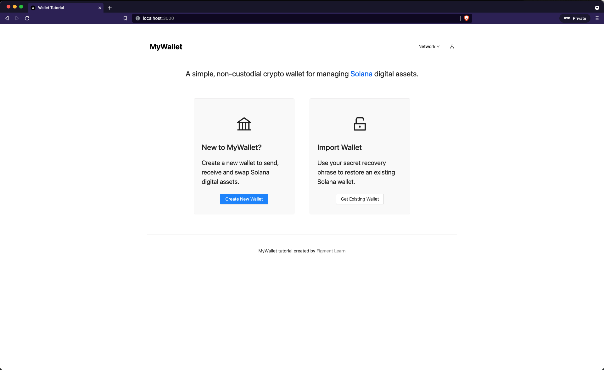

# 🤔 What is the `wallet-dapp`?

Crypto wallets are one of the foundations of Web3. They are the gateway application into crypto ecosystems by enabling users to interact with blockchain protocols and manage digital assets.

Under the hood, wallets leverage cryptographic technologies to generate or recover private keys - a concept that we'll define in the course of this tutorial. Those private keys give users access to public accounts that record ownership on a blockchain and expand the internet's functionality from a global network for information exchange to a global network for disintermediated economic exchange.

In this tutorial, you'll learn to develop a wallet for the [Solana](https://solana.com/) protocol. We will provide a simple Next.js application  that you will complete by leveraging Solana's JavaScript SDK, [@solana/web3.js](https://solana-labs.github.io/solana-web3.js/index.html). In the process, you'll dive into key concepts relevant to Web3 and start to cultivate an understanding for what it takes to build decentralized applications (dApps).



# 🧑‍💻 Getting started
There are no formal blockchain or Web3 prerequisites for this tutorial, but you should have some experience with TypeScript and React. Having said that, you can certainly complete the tutorial if you at least know basic JavaScript. You just may find it more difficult to follow the app's pre-built functionality. 

Make sure you have [git](https://git-scm.com/book/en/v2/Getting-Started-Installing-Git), [Node](https://nodejs.org/en/) and [yarn](https://yarnpkg.com/getting-started/install) installed. Then clone the repo and run the `yarn` command to install the app dependencies:

```
git clone --> add repo link here
cd wallet-tutorial
yarn
```

If you encounter any errors during this process, please join our [Discord](https://discord.gg/fszyM7K) for help.

# Running the development server
Start the Next.js development server on the default port 3000 with:

```
yarn dev
```

Once the server is running, you should see output that looks like this:

```
yarn run v1.22.11
$ next dev
ready - started server on 0.0.0.0:3000, url: http://localhost:3000
info  - Using webpack 5. Reason: Enabled by default https://nextjs.org/docs/messages/webpack5
event - compiled successfully
```

You can now view the running application at [http://localhost:3000](http://localhost:3000)! If you need to run the app in a different port, make sure to specify a port number with the `-p` tag in the [package.json](./package.json) `dev` script (e.g. `next dev -p 8080`).

# Designed by Figment Learn
Our goal at Figment Learn is to build the best resources to help developers build for Web3. We sincerely hope you enjoy the tutorial and thank you for using `wallet-tutorial` to learn about building for Web3 🚀

Learn more about [Figment](https://figment.io/) and [Figment Learn](https://learn.figment.io/)

[Join us on Discord](https://discord.com/invite/fszyM7K) if you have any feedback or questions!

-- The Figment Learn Team
